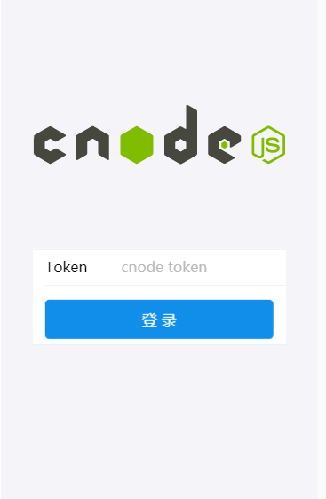

# Dva clone cnode

## how

``` shell
  $ git clone git@github.com:maczyt/dva-cnode.git
  $ yarn // or npm install
  $ yarn start // npm start
```

## now




## todo

- pagination
- item page // important
  - star
  - comment
- ~~login~~
- ~~logout~~
- ~~itemlist~~